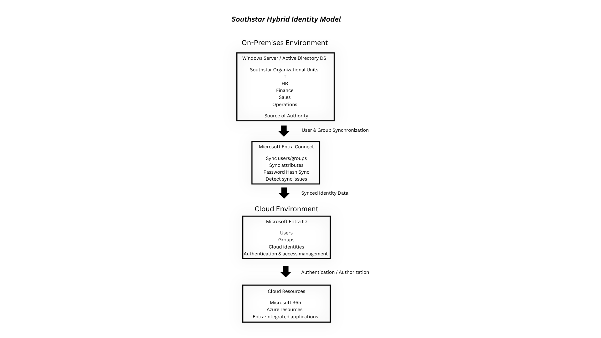

# Southstars Retail – Hybrid Identity & Access Management Lab

## Overview
This project presents a proposed hybrid identity and access management architecture for Southstars Retail, a fictional 30-employee retail organization transitioning to Microsoft cloud services.

The project explores how an organization can integrate an on-premises Windows Server Active Directory environment with Microsoft Entra ID to provide a consistent identity for employees across on-premises and cloud resources.

The project focuses on identity synchronization, password hash synchronization, attribute management, identity lifecycle processes, troubleshooting, and hybrid identity architecture.

Project Scope: This is a portfolio design and simulation project. The on-premises Active Directory environment and Microsoft Entra Connect infrastructure were designed conceptually rather than deployed as a production environment.

## Objectives
- Design a hybrid identity architecture for a fictional organization
- Establish an on-premises Active Directory structure
- Define how identities and attributes would synchronize to Microsoft Entra ID
- Understand Password Hash Synchronization (PHS)
- Define a stable identity-linking strategy between on-premises and cloud identities
- Design Joiner, Mover, and Leaver identity lifecycle processes
- Develop a troubleshooting workflow for synchronization issues
- Document the relationship between Active Directory, Microsoft Entra Connect, and Microsoft Entra ID
- Apply identity and access management concepts to a realistic organizational scenario

## Organization Design
**Organization**: Southstars Retail

**Industry**: Retail

**Employees**: 40

| Department | Employees |
| ---------- | --------: |
| HR         |         3 |
| IT         |         3 |
| Finance    |         4 |
| Operations |        15 |
| Sales      |        15 |
| **Total**  |    **40** |

The organization is adopting Microsoft cloud services while continuing to use an existing on-premises Active Directory environment.

The proposed hybrid identity solution allows employees to use their existing organizational identities to access cloud resources.

## Part 1 – Hybrid Identity Planning

### Hybrid Identity Requirement

Southstars Retail requires a hybrid identity solution because the company is adopting Microsoft cloud services while continuing to use its existing on-premises identity infrastructure.

Employees need to use their existing organizational identities to access both on-premises and cloud resources.

### Identity Sources

#### On-Premises Identity Source:

- Windows Server
- Active Directory Domain Services (AD DS)

#### Cloud Identity Platform:

- Microsoft Entra ID

#### Synchronization Tool:

- Microsoft Entra Connect

Microsoft Entra Connect is used to synchronize identities and selected attributes from the on-premises Active Directory environment to Microsoft Entra ID.

Proposed Identity Flow: On-Premises Active Directory -> Microsoft Entra Connect -> Microsoft Entra ID -> Cloud Resources

## Part 2 – On-Premises Active Directory Design

The proposed on-premises Active Directory environment uses organizational units (OUs) to organize users by department.

### Organizational Units

Southstars Retail:
- IT
- HR
- Finance
- Sales
- Operations

Existing Southstars Retail users were conceptually assigned to their corresponding departmental OU.

### OU vs. Security Group

Organizational Units and security groups serve different purposes.

#### Organizational Units

- Organize directory objects
- Provide a structure for administrative delegation
- Can be used as a target for Group Policy

#### Security Groups

- Control access to resources
- Assign permissions
- Group users based on access requirements

This distinction is important because placing a user in an OU does not automatically provide the same access-control function as assigning the user to a security group.

## Part 3 – Identity Synchronization

### Authoritative Identity Source

The on-premises Active Directory environment is the authoritative identity source for this proposed architecture.

Changes to employee identity information should originate in Active Directory and then synchronize to Microsoft Entra ID.

### Synchronization Tool

Southstars Retail would use Microsoft Entra Connect to synchronize identity information between Active Directory and Microsoft Entra ID.

### Example Attributes

The proposed synchronization includes attributes such as:

- First name
- Last name
- Display name
- User Principal Name (UPN)
- Email address
- Department
- Job title
- Group membership

Microsoft Entra Connect Sync is designed to synchronize identity data between an on-premises environment and Microsoft Entra ID.

### Department Transfer Example

If Rex Anderson moves from Sales to HR:

1. His department and role information are updated in Active Directory.
2. His updated identity information is synchronized to Microsoft Entra ID.
3. IAM personnel review his access.
4. Sales-related access is removed.
5. HR-related access is assigned as appropriate.

Synchronization updates identity information, while access review determines what resources the user should have access to.

## Part 4 – Password Hash Synchronization

Southstars Retail's proposed hybrid identity architecture uses Password Hash Synchronization (PHS) with Microsoft Entra Connect.

### How PHS Works

Password Hash Synchronization synchronizes a hash-derived representation of an on-premises user's password to Microsoft Entra ID rather than sending the user's plaintext password.

This allows users to use the same password for on-premises and cloud sign ins while Microsoft Entra ID handles cloud authentication.

Microsoft says PHS is a hybrid authentication method in which password-derived information is synchronized from Windows Server Active Directory to Microsoft Entra ID.

### Password Change Example

If Alexa Morgan changes her password in Active Directory:

Password changed in Active Directory -> Microsoft Entra Connect -> Password-derived information synchronized -> Microsoft Entra ID

The synchronization process is not necessarily instantaneous, the change is processed through the configured synchronization cycle.

## Part 5 – Attribute & Identity Management

### Identity Linking

The hybrid environment requires a stable way to associate the on-premises identity with the corresponding cloud identity.

The identity-linking value should be based on a stable identifier rather than a value that may change, such as a user's display name.

### Example Synced Attributes
| Attribute          | Purpose                      |
| ------------------ | ---------------------------- |
| First Name         | User identification          |
| Last Name          | User identification          |
| Display Name       | User-facing identity         |
| UPN                | Sign-in identity             |
| Email              | Communication                |
| Department         | Organizational information   |
| Job Title          | Role information             |
| Group Membership   | Access management            |

### Attribute Change Example

If Rex Anderson transfers from Sales to HR:

Active Directory -> Update department / role -> Microsoft Entra Connect -> Synchronize changes -> Microsoft Entra ID -> Access review -> HR access assigned & sales access removed

The synchronization process keeps identity information consistent between the two environments, while IAM personnel remain responsible for reviewing whether the user's access should change.

## Part 6 – Identity Lifecycle & Provisioning

The proposed identity lifecycle follows the Joiner -> Mover -> Leaver model.

### Joiner

When a new employee joins Southstars Retail:

1. Create the employee's account in Active Directory.
2. Configure required identity attributes.
3. Assign appropriate departmental groups.
4. Allow Microsoft Entra Connect to synchronize the identity.
5. Assign or review cloud access.
   
#### Example
New Employee -> Active Directory Account -> Microsoft Entra Connect -> Microsoft Entra ID -> Cloud Access

### Mover

When an employee changes departments or roles:

1. Update the employee's attributes in Active Directory.
2. Update group membership.
3. Synchronize the changes to Microsoft Entra ID.
4. Review the user's existing access.
5. Remove access that is no longer required.
6. Assign access appropriate for the new role.

#### Example (Sales → HR)
Update AD -> Sync to Entra -> Remove Sales Access -> Assign HR Access

### Leaver

When an employee leaves the organization:

1. Disable the Active Directory account.
2. Remove or review group memberships.
3. Allow identity changes to synchronize.
4. Review cloud access.
5. Ensure access is removed or otherwise appropriately restricted.

### Lifecycle Summary
| Lifecycle Event    | Active Directory                                | Microsoft Entra ID                              |
| ------------------ | ----------------------------------------------- | ----------------------------------------------- |
| Joiner             | Create account and assign attributes/groups     | Identity synchronized and cloud access reviewed |
| Mover              | Update department, role, and group membership   | Identity updated and access reviewed            |
| Leaver             | Disable account and remove/review access        | Cloud identity/access updated and reviewed      |

Microsoft says provisioning is creating, maintaining, and removing identity objects based on defined conditions, while synchronization keeps identity information aligned between directories.

## Part 7 – Synchronization Troubleshooting

### Scenario

A new employee, Daniel Carter, is hired as an IT Support Specialist.

IT creates Daniel's account in the on-premises Active Directory environment, but after the expected synchronization period, Daniel does not appear in Microsoft Entra ID.

The following have already been confirmed:

- Daniel's Active Directory account exists.
- The account is enabled.
- Department and job title are correct.
- Microsoft Entra Connect is installed.
- Other employees are synchronizing successfully.

### Troubleshooting Step 1 – Check Active Directory

First, verify:

- Account existence
- Account enabled/disabled status
- Required attributes
- User Principal Name
- Organizational Unit placement
- Whether the OU is included within the synchronization scope

### Troubleshooting Step 2 – Check Microsoft Entra Connect

Review:

- Synchronization service status
- Synchronization errors
- Import activity
- Synchronization activity
- Export activity

Microsoft Entra Connect synchronization processes identity information through import, synchronization, and export operations.

### Troubleshooting Step 3 – Check Synchronization Scope

If Daniel's account is located in an OU that is excluded from synchronization, the account may not be selected for synchronization.

The synchronization scope should be reviewed and corrected if the OU or object is incorrectly excluded.

### Troubleshooting Step 4 – Check for Duplicate UPNs

If Daniel's UPN conflicts with another identity:

1. Identify the conflicting account.
2. Determine which identity should own the UPN.
3. Correct the conflicting attribute.
4. Allow synchronization to process the change.
5. Verify the resulting identity in Microsoft Entra ID.

Duplicate attribute conflicts, including UPN conflicts, are common synchronization troubleshooting scenarios.

### Troubleshooting Workflow
Daniel exists in Active Directory? -> Check account status & attributes -> Check OU / synchronization scope -> Check Microsoft Entra Connect -> Check synchronization errors -> Identify and correct issue -> Run / wait for synchronization -> Verify Daniel in Microsoft Entra ID

## Part 8 – Hybrid Identity Architecture

The following diagram represents the proposed hybrid identity architecture for Southstars Retail.

### Architecture Components

#### On-Premises Active Directory

- Source of authority
- Stores organizational identities
- Contains departmental OUs and groups

#### Microsoft Entra Connect

- Synchronizes identity information
- Synchronizes selected attributes
- Supports Password Hash Synchronization
- Provides the synchronization layer between Active Directory and Microsoft Entra ID

#### Microsoft Entra ID

- Provides cloud identity management
- Stores synchronized cloud identities
- Supports authentication and access management

#### Cloud Resources

- Microsoft 365
- Azure resources
- Entra-integrated applications

Implementation: The architecture above represents a proposed design for Southstars Retail. The Active Directory and Microsoft Entra Connect components were designed and documented conceptually rather than deployed in a production environment.

## Technologies & Concepts

### Technologies
- Microsoft Entra ID
- Microsoft Entra Connect
- Windows Server Active Directory
- Microsoft Azure

### IAM Concepts
- Hybrid Identity
- Identity Synchronization
- Password Hash Synchronization
- Attribute Synchronization
- Source of Authority
- Identity Lifecycle Management
- Joiner / Mover / Leaver
- Role and Group-Based Access
- Identity Troubleshooting
- Access Review
- Least Privilege

## Project Scope & Limitations

This project was developed as a portfolio-based identity and access management design exercise.

The Microsoft Entra environment used for learning was a Microsoft Entra ID Free environment, while the on-premises Active Directory and Microsoft Entra Connect portions were designed conceptually.

The project focuses on demonstrating understanding of:

- Hybrid identity architecture
- Directory synchronization
- Identity lifecycle management
- Authentication concepts
- Attribute management
- Troubleshooting methodology
- IAM design principles

The project does not use a production deployment of Windows Server Active Directory or Microsoft Entra Connect.

## Takeaways

This project demonstrates how an organization can design a hybrid identity environment that connects an on-premises Active Directory infrastructure with Microsoft Entra ID.

The project emphasizes the importance of:

- Establishing a clear source of authority
- Maintaining consistent identity attributes
- Synchronizing identities securely
- Managing employee lifecycle changes
- Reviewing access when users change roles
- Troubleshooting synchronization issues systematically
- Separating identity synchronization from access management

The completed design provides a foundation for managing identities across both on-premises and cloud environments while applying core Identity and Access Management principles.
